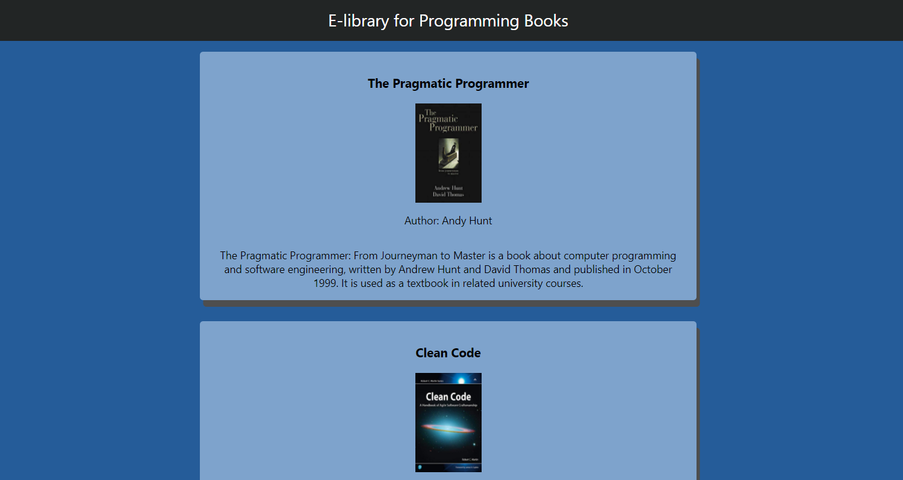

# Book Finder App
This is a demo application using React and [Contentful](https://www.contentful.com/) headless CMS. 

It uses Contentful [GraphQL Content API](https://www.contentful.com/developers/docs/references/graphql/) for fetching content. It fetches Content-Type "Book" having following fields - title, author, image, description. 

 
 

# Run Locally
To get the project running, clone this repository and follow these steps:

- Install all the project's dependencies:
```
yarn or npm install
```
- Enter the values in `.env` file for below variables: 
```
REACT_APP_GRAPHQL_URL
REACT_APP_ACCESS_TOKEN
```
- Once that's done, run the project:
```
npm start or yarn start
```
- Access the app at: 
```
http://locahost:3000
```
